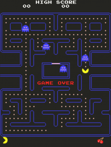

# Pacman

Pacman. Written in TypeScript.  [Play it now, if you like](http://pacman.backroomsoftware.com/)

  

The goal of this project was to learn TypeScript.  I never intended
releasing the source code, but a few people asked for it, so here it is.  Please go easy on me, it's my first go!

## License
GNU GENERAL PUBLIC LICENSE Version 3 [#](LICENSE.txt)

## Donations
If you found this project helpful, or if the source code was useful (or you found it caused much hilarity), or even if you just enjoyed playing the game,
then feel free to donating a small amount to [charity](https://www.justgiving.com/fundraising/steve-dunn7).

## Project Layout

### Folders
#### Core
This folder contains core items that aren't specific to Pacman.  Things like
Canvas, Sprite, timers, and fundamental types such as Point and Rect.

#### Game
Game specific types, such as GameStats, PlayerStats, Tile, Fruit, and PacMan.

#### Ghosts
Ghost specific types, such as Inky, Pinky, Blink & Clyde.  Also contains the logic
for moving the ghosts.

#### Scenes
Cut-scene specific types.

